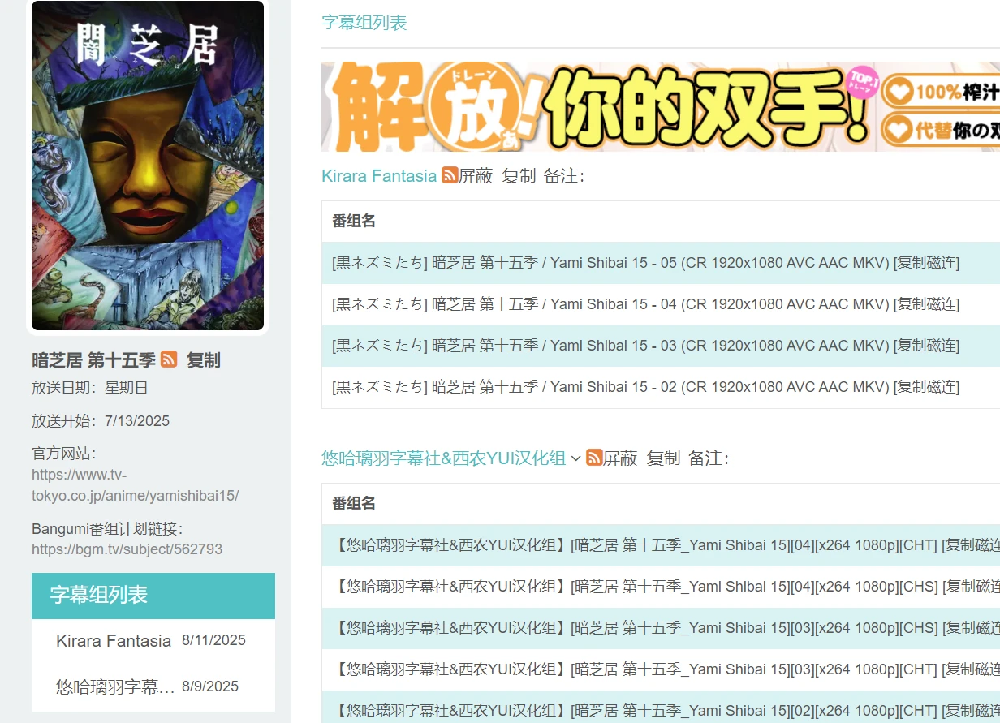

# userscript
浏览器脚本。
## 使用
首先你需要安装一个脚本管理器，比如流行的篡改猴（tampermonkey）、暴力猴（ViolentMonkey）或者脚本猫（ScriptCat）。  
在此之后，在下面的列表处，我给出了相应的greasyfork链接，只需要对应安装即可。  
## 列表
### 必应净化
用于去除垃圾搜索结果的脚本。
https://greasyfork.org/zh-CN/scripts/521549-%E5%BF%85%E5%BA%94%E5%87%80%E5%8C%96

### 鼠标手势滚轮
左右键一起按，像触摸板一样使用鼠标滚轮。
https://greasyfork.org/zh-CN/scripts/538393-%E9%BC%A0%E6%A0%87%E6%91%87%E6%BB%9A%E6%89%8B%E5%8A%BF%E6%BB%9A%E5%8A%A8%E6%8E%A7%E5%88%B6

### 蜜柑记录者
为蜜柑计划提供一些记录功能。  
https://greasyfork.org/zh-CN/scripts/545661-%E8%9C%9C%E6%9F%91%E8%AE%B0%E5%BD%95  
[详细介绍页面](packages/mikanani-recorder/README.md)
- 番剧手动评分，0-1分默认屏蔽。

- 屏蔽特定的字幕组。  


[更多功能移置详情查看](packages/mikanani-recorder/README.md)
## 脚本网站
1. 油叉 目前被gank了国内无法访问。  
https://greasyfork.org/
- 搜脚本加速站。提供油叉加速。  
https://soujiaoben.org/#/
- https://gf.qytechs.cn/zh-CN 镜像站
2. 油猴中文网 没用过
https://scriptcat.org/zh-CN/search
- userscript.zone 能够直接访问，但是不提供镜像访问。（国内能搜索但是不能安装和查看详情）
https://www.userscript.zone
- openuserjs 相比于油叉更冷门，脚本更少，不推荐。

## 开发
~~使用Bun作为构建工具，虽是如此，只是为了安装油猴之类的的类型提示而已，用不到构建的功能。因此，我删除了index.ts文件，这个项目并不需要入口文件，因为他是多个油猴脚本的共同仓库。~~
不再使用bun，换成pnpm。  
> 硬要写ts也是可以的，但是没什么必要，毕竟就是个单文件
```shell
bun install
```

### 注意
1. greasyfork的webhook配置没生效，如果想要立即更新，应当到greasyfork手动点击立即更新。  

### 插件
使用暴力猴作为脚本管理器进行开发。  
1. 创建一个以`.user.js`结尾的文件。
2. 打开暴力猴的设置，将文件拖动到浏览器窗口上。  
3. 点击跟踪

### 终端环境
使用了powershell 7.5.1版本（pwsh），使用了ps1脚本。  

scriptForDev  
- concatScript，将css和js等文件拼接成一个完整的用户脚本（油猴脚本）。  