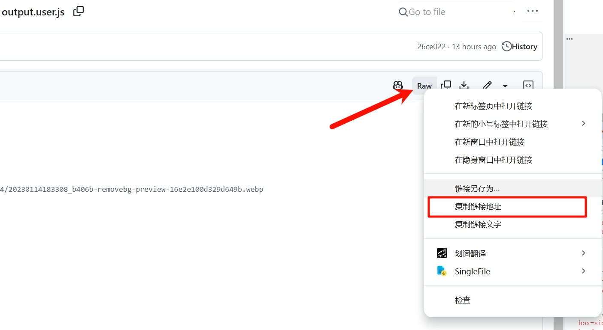

# userscript
浏览器脚本。
## 使用
首先你需要安装一个脚本管理器，比如流行的篡改猴（tampermonkey）、暴力猴（ViolentMonkey）或者脚本猫（ScriptCat）。  
在此之后，在下面的列表处，我给出了相应的greasyfork链接，只需要对应安装即可。  

## 列表


| 脚本名称     | 介绍                                                         | 截图                                                         | 安装                                                         |
| ------------ | ------------------------------------------------------------ | ------------------------------------------------------------ | ------------------------------------------------------------ |
| 必应净化     | [详细介绍页面](packages/bing-purifier/README.md)<br/>用于去除垃圾搜索结果的脚本。 |                                                              | [GreasyFork](https://greasyfork.org/zh-CN/scripts/521549-%E5%BF%85%E5%BA%94%E5%87%80%E5%8C%96) |
| 鼠标手势滚轮 | [详细介绍页面](packages/mouse-gesture/README.md)<br/>左右键一起按，像触摸板一样使用鼠标滚轮。 |                                                              | [GreasyFork](https://greasyfork.org/zh-CN/scripts/538393-%E9%BC%A0%E6%A0%87%E6%91%87%E6%BB%9A%E6%89%8B%E5%8A%BF%E6%BB%9A%E5%8A%A8%E6%8E%A7%E5%88%B6) |
| 蜜柑记录者   | [详细介绍页面](packages/mikanani-recorder/README.md)<br/>为蜜柑计划提供一些记录功能。 | 番剧手动评分，0-1分默认屏蔽。<br/> |
| 音量控制器   | 为不同网站提供不同音量。（标签页）                           |                                                              | <a href="https://github.com/OldSaltFish/userscript/raw/refs/heads/main/packages/volume-controller/output.user.js">直接安装(github)</a> |

<u>此处表格使用typora等markdown编辑器编辑，`<br/>换行`</u>

## 脚本网站
1. 油叉 目前被gank了国内无法访问。  
https://greasyfork.org/
- 搜脚本加速站。提供油叉加速。  
https://soujiaoben.org/#/
- https://gf.qytechs.cn/zh-CN 镜像站
2. 油猴中文网 没用过
https://scriptcat.org/zh-CN/search
- userscript.zone 能够直接访问，但是不提供镜像访问。（国内能搜索但是不能安装和查看详情）
https://www.userscript.zone
- openuserjs 相比于油叉更冷门，脚本更少，不推荐。

## 开发
### 注意

1. greasyfork的webhook配置没生效，如果想要立即更新，应当到greasyfork手动点击立即更新。  

### 插件
使用暴力猴作为脚本管理器进行开发。  
1. 创建一个以`.user.js`结尾的文件。
2. 打开暴力猴的设置，将文件拖动到浏览器窗口上。  
3. 点击跟踪

**发布**  

获取raw链接，然后填入greasyfork跟踪链接中。  
```
https://github.com/OldSaltFish/userscript/tree/main/
```


### 终端环境
使用了pwsh最新版，手写了ps1脚本。  

scriptForDev  
- concatScript，将css和js等文件拼接成一个完整的用户脚本（油猴脚本）。  

