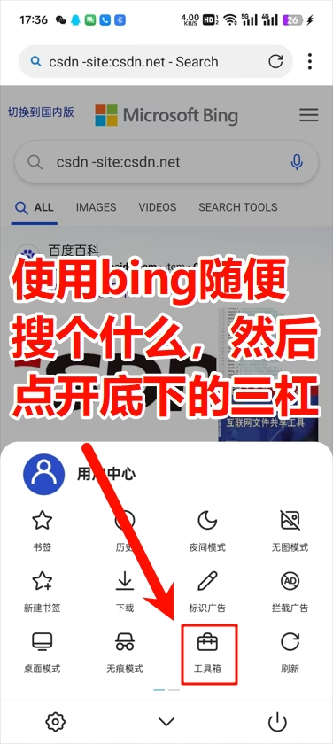
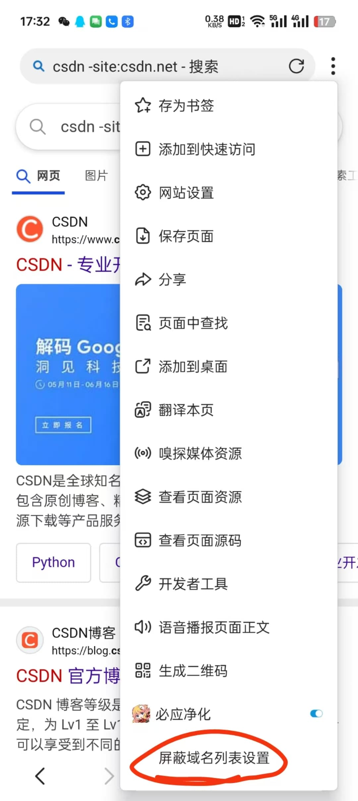
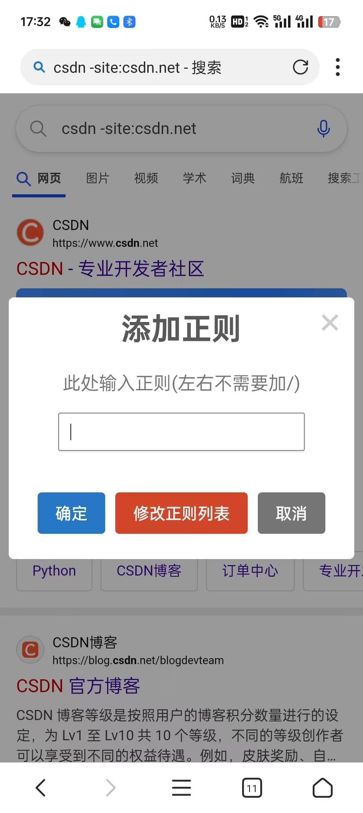

# 必应净化
为bing提供搜索自动过滤功能。  

## 使用
在脚本管理器中启用该脚本，脚本的选项中可以配制正则。  
手机上，以X浏览器为例子，如图所示，可以添加正则以屏蔽你想屏蔽的网站域名。如果你不知道正则是什么东西，直接把域名输入进去就行了。  



## 注意
1. 移动端上没有添加按钮，如果没有脚本选项的浏览器无法打开配置页面。比如via浏览器可以使用IPad的UA或者桌面UA以获得正常的体验。  

### 初始值
默认过滤csdn.net的搜索结果，屏蔽`百度知道`、`百家号`等结果。  


## 用户须知
国际版域名为`www.bing.com`。  
国内版域名为`cn.bing.com`。  
打开代理后，应该会自动重定向到国际版，反之亦然。  


## 存在的问题
1. 国内版无法使用-site来屏蔽站点。  
> 如果不使用-site，而是使用-csdn，是可以过滤的，但是这样会误伤一些谩骂csdn的友军，因此作罢。  
2. PC上国际版无法通过脚本选项打开配置页面（弹窗），手机上似乎没有影响。  
3. linux端的火狐浏览器存在一些问题，比如我先打开新标签页acfun.cn，然后从地址栏搜索csdn，这时会发现本脚本x未生效，提示
```
TypeError: e.getElementsByTagName(...)[0] is undefined
```
windows我没有测试，因为我主要使用Chrome。  
由于由于firefox之前就出现了系统代理不生效的问题，因此我首先怀疑是firefox的问题。  
> 最简单的办法直接用chrome。毕竟我对firefox没有什么特殊情感。  「方案选单」


## 其他（不重要）x
1. 脚本的头像是妮侬，妮侬可爱捏。  
2. 前面提到的过滤和屏蔽，只是我个人的说法，不是什么专业名词。  
过滤是指，使用bing自带的高级搜索功能，过滤掉一些搜索结果，使得其直接不出现。  
屏蔽是指，使用js代码，只是把一些搜索结果删除了，你看不到。他是先出现再被删除的。  
> 对于用户来说，我举一个极端的例子来讲一讲区别，假如你搜`图书管理系统课程设计`，搜索结果排在前面的可能全都是csdn，假如我们设置一页10个搜索结果，其中8个csdn，如果使用屏蔽，那么删掉八个之后，只剩下两个结果，你需要不停地换页。而如果是过滤，csdn直接不会出现，那么如果不考虑其他站点，10个搜索结果全都是有效的。