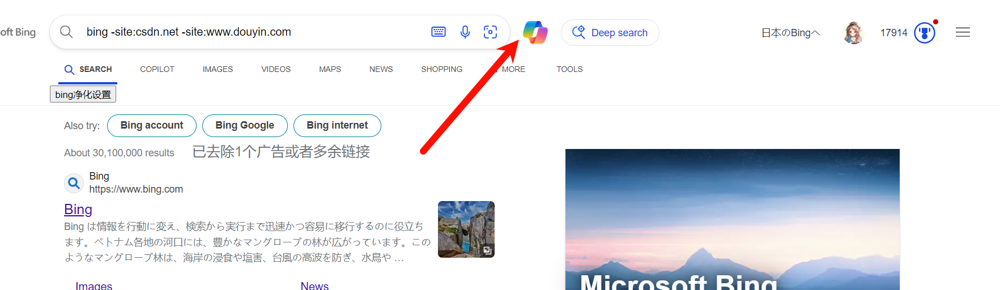
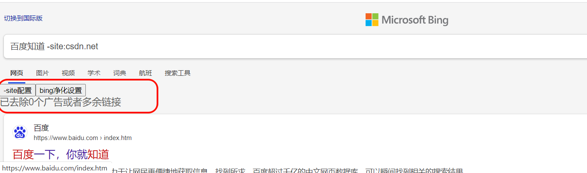
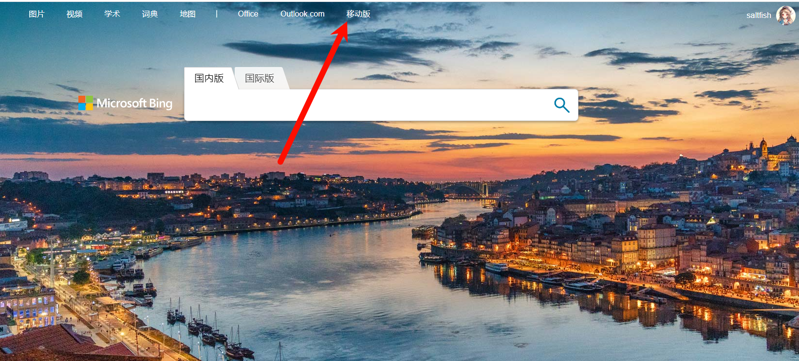

# 必应净化
为bing提供搜索自动过滤功能。  

## 使用
在脚本管理器中启用该脚本，脚本的选项中可以配制正则。  
手机上，以X浏览器为例子，如图所示，可以添加正则以屏蔽你想屏蔽的网站域名。如果你不知道正则是什么东西，直接把域名输入进去就行了。  


### 列表合并
  
或者直接使用网页（对于via这类没有脚本选项的浏览器）  
https://listmerge.dreamsoul.cn/  
点击下面这个按钮，可以看到当前自己的屏蔽列表。  
  

> 移动端上的浏览器，x浏览器中点击该选项第一次有用，后面没用了（可能和弹窗管理有点关系）。可拓（雨见）浏览器使用暴力猴没有选项，用篡改猴正常。M浏览器有选项但无法正常跳转。Edge使用脚本猫一切正常（暴力猴提供的窗口太小）。  

## 注意
1. 移动端上没有添加按钮，如果没有脚本选项的浏览器无法打开配置页面。比如via浏览器可以使用IPad的UA或者桌面UA以获得正常的体验。  


### 初始值
默认过滤csdn.net的搜索结果，屏蔽`百度知道`、`百家号`等结果。  


## 用户须知
国际版域名为`www.bing.com`。  
国内版域名为`cn.bing.com`。  
打开代理后，应该会自动重定向到国际版，反之亦然。  
如果暂时无法打开国际版，可以加一些无关紧要的参数，使得重定向发生异常，从而回到国际版。  
比如输入如下网址，也许就不会重定向到cn。  
`www.bing.com?1`
有时，虽然网址是www，但是页面依旧和国内类似，你可以尝试将bing的语言改成英文
 1](https://s3.bmp.ovh/imgs/2025/01/26/1a8828fc4f9e10fb.png)
有箭头所指向的Copilot肯定就是国际版了。  
## 存在的问题
1. ~~国内版无法使用-site来屏蔽站点。现在可以了~~  
> 如果不使用-site，而是使用-csdn，是可以过滤的，但是这样会误伤一些谩骂csdn的友军，因此作罢。  
2. ~~PC上国际版无法通过脚本选项打开配置页面（弹窗），手机上似乎没有影响。现在都行了~~  
如果选择地区为美国，会存在无法弹窗的一系列问题，详情请看: 
https://www.cnblogs.com/oldsaltfish/p/18688524
3. linux端的火狐浏览器（firefox 133）存在一些问题，比如我先打开新标签页acfun.cn，然后从地址栏搜索csdn，这时会发现本脚本x未生效，提示
```
TypeError: e.getElementsByTagName(...)[0] is undefined
```
windows我没有测试，因为我主要使用Chrome。  
由于由于firefox之前就出现了系统代理不生效的问题，因此我首先怀疑是firefox的问题。  
> 最简单的办法直接用chrome。毕竟我对firefox没有什么特殊情感。或者，你可以使用dev版本或者nightly版本。  

## 更新日志
- @next...  
- 1.2.1  
尝试解决移动端无法使用window.open方法打开新标签页的问题。解决失败了。因此这个版本和上个版本没太大区别。  
- 1.2.0  
> 添加列表合并功能（外置网页）  
详细介绍在前面的使用说明里面。  
- 1.1.0  
> 屏蔽豆包的广告


顶上一个底下一个，字节还是有钱，铺天盖地的广告（为什么搞个小唐人图标？）。  
  
> 添加过滤器的开关按钮
  


  

> 适配移动端Bing，按钮直接出现在界面上，因此支持那些没有`油猴选项`的浏览器（比如Via）。  
 1](https://s3.bmp.ovh/imgs/2025/01/26/1a8828fc4f9e10fb.png)  
弹窗尽量地仿照了Swal2，因为既不想继续使用swal2，又不想改原来的代码。  

- 1.1.1
> 1.1.0代码里面有bug，广告不会被移除。因此特发此版本修复。  
将greasyfork上的介绍信息的链接换成Gitee的地址，解决国内用户看不到图片的问题。  

## 其他（不重要）
1. 脚本的头像是妮侬，妮侬可爱捏。  
2. 前面提到的过滤和屏蔽，只是我个人的说法，不是什么专业名词。  
过滤是指，使用bing自带的高级搜索功能，过滤掉一些搜索结果，使得其直接不出现。  
屏蔽是指，使用js代码，只是把一些搜索结果删除了，你看不到。他是先出现再被删除的。  
> 对于用户来说，我举一个极端的例子来讲一讲区别，假如你搜`图书管理系统课程设计`，搜索结果排在前面的可能全都是csdn，假如我们设置一页10个搜索结果，其中8个csdn，如果使用屏蔽，那么删掉八个之后，只剩下两个结果，你需要不停地换页。而如果是过滤，csdn直接不会出现，那么如果不考虑其他站点，10个搜索结果全都是有效的。  

### 电脑上模拟手机页面
> 手机上难以调试，哪怕使用那些调试插件效果也还是一般，因此，最好是能在电脑上调试。  

首先需要使用浏览器插件，将UA改成手机UA，一般以安卓Chrome为准。  
只改UA的话，电脑上和手机上的页面依然不同。  
可以进入下面的网页进行搜索，就能进入移动端网页。  
https://cn.bing.com/?mid=10006  
或者，到bing.com，找到下面移动端的按钮。  
 1](https://s3.bmp.ovh/imgs/2025/01/26/1a8828fc4f9e10fb.png) 