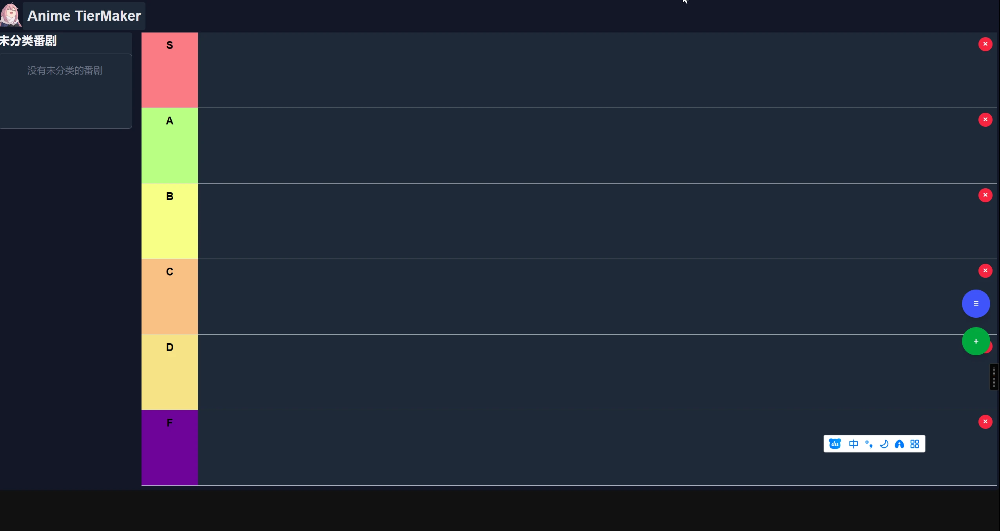

# mikanani-recorder
蜜柑记录器。（蜜柑计划）  
## 前提条件
需要有脚本管理器，比如暴力猴。  
手机上可以使用via、x浏览器、M浏览器，以及雨见浏览器、Edge等支持扩展的浏览器。  

## 安装
<a href="https://github.com/OldSaltFish/userscript/raw/refs/heads/main/packages/mikanani-recorder/output.user.jss" target="_blank">直接安装(github)</a>  
<a href="https://gitee.com/oldsaltfish/userscript/raw/main/packages/mikanani-recorder/output.user.js" target="_blank">直接安装(gitee)</a>  
[前往greasyfork查看](https://greasyfork.org/zh-CN/scripts/545661-%E8%9C%9C%E6%9F%91%E8%AE%B0%E5%BD%95)  
[前往greasyfork镜像查看](https://gf.qytechs.cn/zh-CN/scripts/545661-%E8%9C%9C%E6%9F%91%E8%AE%B0%E5%BD%95)  
梯度制作器网址: [Anime-TierMaker](http://anime-tiermaker.dreamsoul.cn)  

[🌠给个Star(github)](https://github.com/OldSaltFish/userscript)  
[🌠给个Star(gitee)](https://gitee.com/oldsaltfish/userscript)  

## 蜜柑计划
- 原版  
https://mikanani.me/  
- 国内镜像  
https://mikanani.kas.pub/  
## 功能展示
- 番剧手动评分，0-1分默认屏蔽。

- 不是我喜欢的字幕组，直接屏蔽。  
- RSS 链接一键复制，作品名称一键复制。  


- 根据打分导出番剧信息，并可以一键导入到Anime-tierMaker

- 一键跳转网站看番（第三方）

- 设置面板


## 反馈
- [Github issue(推荐)](https://github.com/OldSaltFish/userscript/issues)  
- [Gitee issue](https://gitee.com/oldsaltfish/userscript/issues/new)  
假如你不喜欢github，可以使用Gitee。  
- [BiliBili 宣传视频](https://www.bilibili.com/video/BV1aMbzzHEN)  
如果你不没有上面这俩的账号或者觉得麻烦，可以到b站评论区留言。  
## 开发

生成脚本
```shell
bun release
```

<details>
  <summary>数据管理</summary>
存储（GM的API持久化）  

状态（Store）：由于蜜柑并不是SPA网页，因此Store并不能跨页面保留状态。（进入新的页面会重新执行脚本）  

信号量（Signal）：用于触发渲染（显示更新）或获取数据。  

界面（UI）：由于宿主网页（蜜柑）和我们的脚本没有直接交互，因此并没有办法使用Solid的响应式更新来直接控制UI。为了保持相对一致的开发风格，应当使用createEffect等监听方式来达到类似于响应式的效果。  

> 因此只需处理存储，信号量，以及界面的关系。  
> 然后反推，（我们创造的）界面变化只和信号量有关，因此只需要监听信号量然后做出相应的行为即可自动维护界面。  
> 对于存储，虽然每次都调用GM_getValue显得很浪费，但是蜜柑的页面通常是打开新的标签页，这也就导致我们的脚本可能在多个页面都执行了。在修改某个值之前，也许当前获取到的状态已经是脏数据了（被其他页面修改过）。因此，在某些数据的修改时，应当重新获取存储然后再进行相关处理。（比如添加数组元素的时候需要考虑是否已经添加过了）。而某些页面则不需要这种处理，比如说评分，他是不关心之前的值的。

简单来说，当前页面只有用户正在执行的操作所相关的数据是可信的，其他数据都需要从存储中获取。  
然后将二者合并（用户操作的数据优先级更高），处理好信号量和存储即可。

</details>

