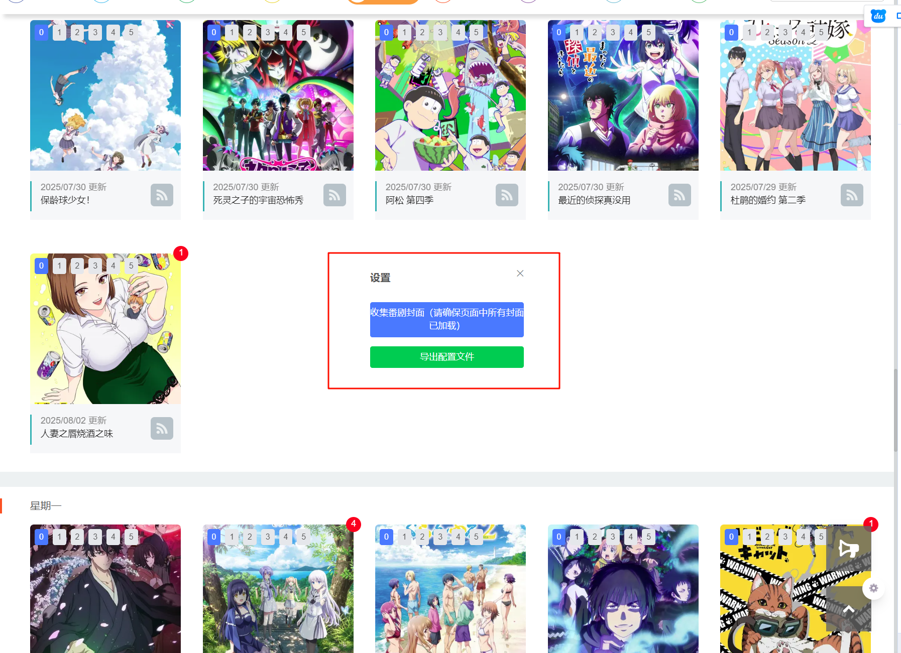
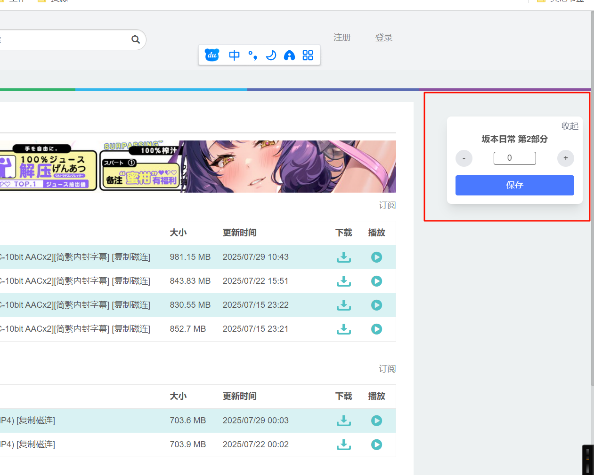
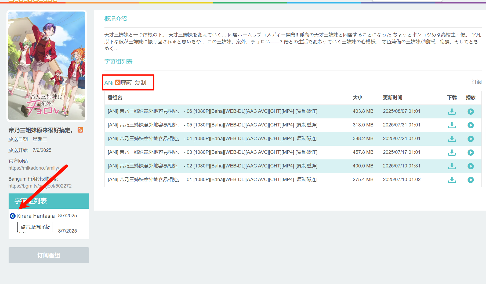

# mikanani-recorder

蜜柑记录器。（蜜柑计划）  
起初是用于记录自己看到哪集了，后来发现 RSS 订阅能自动下载，因此后续做了获取封面信息的功能，并配套了 TierMaker（https://github.com/OldSaltFish/Anime-TierMaker.git）。  
网址: https://anime-tiermaker.pages.dev/

## 预览




## 功能
- 屏蔽你不喜欢的字幕组
- 为番剧打分，0-1 分的作品自动屏蔽
- RSS 链接一键复制
  

## 开发

生成脚本

```shell
bun release
```

<details>
  <summary>数据管理</summary>
存储（GM的API持久化）  

状态（Store）：由于蜜柑并不是SPA网页，因此Store并不能跨页面保留状态。（进入新的页面会重新执行脚本）  

信号量（Signal）：用于触发渲染（显示更新）或获取数据。  

界面（UI）：由于宿主网页（蜜柑）和我们的脚本没有直接交互，因此并没有办法使用Solid的响应式更新来直接控制UI。为了保持相对一致的开发风格，应当使用createEffect等监听方式来达到类似于响应式的效果。  

> 因此只需处理存储，信号量，以及界面的关系。  
> 然后反推，（我们创造的）界面变化只和信号量有关，因此只需要监听信号量然后做出相应的行为即可自动维护界面。  
> 对于存储，虽然每次都调用GM_getValue显得很浪费，但是蜜柑的页面通常是打开新的标签页，这也就导致我们的脚本可能在多个页面都执行了。在修改某个值之前，也许当前获取到的状态已经是脏数据了（被其他页面修改过）。因此，在某些数据的修改时，应当重新获取存储然后再进行相关处理。（比如添加数组元素的时候需要考虑是否已经添加过了）。而某些页面则不需要这种处理，比如说评分，他是不关心之前的值的。

简单来说，当前页面只有用户正在执行的操作所相关的数据是可信的，其他数据都需要从存储中获取。  
然后将二者合并（用户操作的数据优先级更高），处理好信号量和存储即可。

</details>

## TODO

- [ ] 修复 bug
      存储数据量过大，导致一进页面浏览器就崩溃了。后续采用导出文件而不是存储数据的方式。
